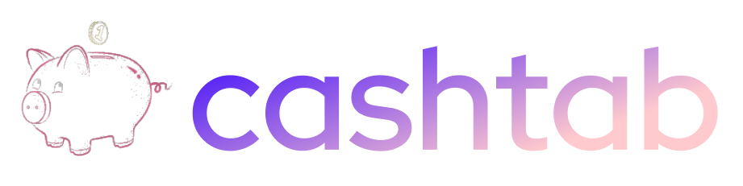

# 💰 CashTab - Aplicativo de Gestão Financeira

<div align="center">
  
  
  [](https://reactnative.dev/)
  [](https://expo.dev/)
  [](https://www.typescriptlang.org/)
  [](LICENSE)
</div>

## 📱 Sobre o Projeto

O **CashTab** é um aplicativo mobile completo para gestão financeira pessoal, desenvolvido com React Native e Expo. Permite aos usuários controlar despesas, receitas, visualizar relatórios detalhados e manter uma visão clara de sua saúde financeira.

## ✨ Funcionalidades Principais

### 🔐 Autenticação
- Sistema de login e registro de usuários
- Autenticação segura com tokens
- Persistência de sessão

### 💳 Gestão Financeira
- **Dashboard** com visão geral das finanças
- **Despesas**: Adicionar, editar e categorizar despesas
- **Receitas**: Registrar e acompanhar receitas
- **Categorização** automática de transações

### 📊 Relatórios e Análises
- **Relatório Mensal**: Análise detalhada por mês
- **Relatório Anual**: Visão anual das finanças
- **Relatório por Categorias**: Distribuição de gastos
- **Tendências**: Análise de padrões de gastos
- **Saúde Financeira**: Indicadores de bem-estar financeiro
- **Previsões**: Análise preditiva baseada em histórico

### 🎨 Interface Moderna
- Design responsivo e intuitivo
- Tema claro/escuro
- Animações suaves
- Componentes reutilizáveis

## 🛠️ Tecnologias Utilizadas

### Frontend
- **React Native** (0.79.3) - Framework mobile
- **Expo** (53.0.0) - Plataforma de desenvolvimento
- **TypeScript** (5.8.3) - Tipagem estática
- **React Navigation** - Navegação entre telas
- **Styled Components** - Estilização

### Gráficos e Visualização
- **Victory** - Biblioteca de gráficos
- **React Native Chart Kit** - Componentes de gráficos
- **React Native SVG** - Suporte a SVG

### Estado e Gerenciamento
- **Zustand** - Gerenciamento de estado
- **AsyncStorage** - Armazenamento local

### Utilitários
- **Axios** - Cliente HTTP
- **Expo Haptics** - Feedback tátil
- **React Native Toast Message** - Notificações

## 📁 Estrutura do Projeto

```
cashtab/
├── app/                    # Telas principais
│   ├── (tabs)/            # Navegação por abas
│   ├── Relatorios/        # Telas de relatórios
│   ├── Dashboard.tsx      # Dashboard principal
│   ├── Login.tsx          # Tela de login
│   ├── Register.tsx       # Tela de registro
│   └── ...
├── components/            # Componentes reutilizáveis
│   ├── ui/               # Componentes de UI
│   ├── Layout.tsx        # Layout principal
│   └── Menu.tsx          # Menu de navegação
├── hooks/                # Custom hooks
│   ├── useAuth.ts        # Hook de autenticação
│   └── useColorScheme.ts # Hook de tema
├── services/             # Serviços de API
├── constants/            # Constantes do projeto
├── assets/               # Recursos estáticos
│   └── images/           # Imagens do projeto
└── scripts/              # Scripts utilitários
```

## 🚀 Como Executar

### Pré-requisitos
- Node.js (versão 18 ou superior)
- npm ou yarn
- Expo CLI
- Android Studio (para Android) ou Xcode (para iOS)

### Instalação

1. **Clone o repositório**
```bash
git clone https://github.com/DellisLucas/PI-FRONT.git
cd cashtab
```

2. **Instale as dependências**
```bash
npm install
# ou
yarn install
```

3. **Execute o projeto**
```bash
# Desenvolvimento
npm start
# ou
expo start

# Android
npm run android

# iOS
npm run ios

# Web
npm run web
```

### Scripts Disponíveis

```bash
npm start          # Inicia o servidor de desenvolvimento
npm run android    # Executa no Android
npm run ios        # Executa no iOS
npm run web        # Executa na web
npm run lint       # Executa o linter
npm run reset-project # Reseta o projeto
```

## 📱 Funcionalidades Detalhadas

### Dashboard
- Visão geral do saldo atual
- Resumo de despesas e receitas do mês
- Gráficos de tendências
- Acesso rápido às principais funcionalidades

### Gestão de Despesas
- Adicionar novas despesas com categoria
- Editar despesas existentes
- Visualizar histórico de despesas
- Filtros por período e categoria

### Gestão de Receitas
- Registrar novas receitas
- Categorizar receitas
- Acompanhar histórico de receitas
- Análise de fontes de renda

### Relatórios
- **Mensal**: Análise detalhada por mês
- **Anual**: Visão anual com comparações
- **Categorias**: Distribuição de gastos por categoria
- **Tendências**: Padrões de comportamento financeiro
- **Saúde Financeira**: Indicadores de bem-estar
- **Previsões**: Análise preditiva baseada em dados históricos

## 🎨 Design System

O projeto utiliza um design system consistente com:
- Paleta de cores definida
- Tipografia padronizada
- Componentes reutilizáveis
- Animações suaves
- Feedback visual e tátil

## 🔧 Configuração de Desenvolvimento

### Variáveis de Ambiente
Crie um arquivo `.env` na raiz do projeto:
```env
API_URL=sua_url_da_api
```

### Estrutura de Branches
- `main` - Código de produção
- `sistema-mobile` - Desenvolvimento mobile
- `feature/*` - Novas funcionalidades
- `fix/*` - Correções de bugs

## 📊 Métricas do Projeto

- **Linguagens**: JavaScript (72.8%), CSS (24.9%), HTML (2.3%)
- **Contribuidores**: 4 desenvolvedores
- **Versão**: 1.0.0
- **Plataforma**: Mobile (iOS/Android) + Web

## 🤝 Contribuição

1. Faça um fork do projeto
2. Crie uma branch para sua feature (`git checkout -b feature/AmazingFeature`)
3. Commit suas mudanças (`git commit -m 'Add some AmazingFeature'`)
4. Push para a branch (`git push origin feature/AmazingFeature`)
5. Abra um Pull Request

## 📝 Licença

Este projeto está sob a licença MIT. Veja o arquivo [LICENSE](LICENSE) para mais detalhes.


## 🔗 Links Úteis

- [Documentação do React Native](https://reactnative.dev/docs/getting-started)
- [Documentação do Expo](https://docs.expo.dev/)
- [Documentação do Victory](https://formidable.com/open-source/victory/docs/)
- [Repositório no GitHub](https://github.com/DellisLucas/PI-FRONT)

---

<div align="center">
  <p>Desenvolvido com ❤️ pela equipe CashTab</p>
  <p>💰 Controle suas finanças de forma inteligente!</p>
</div>
